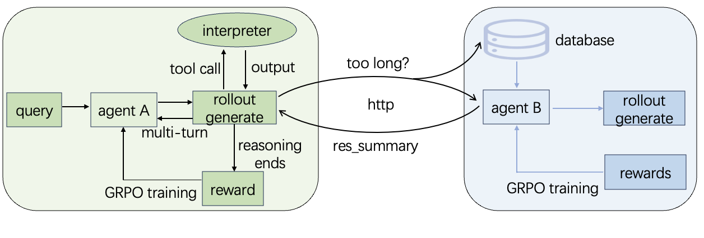
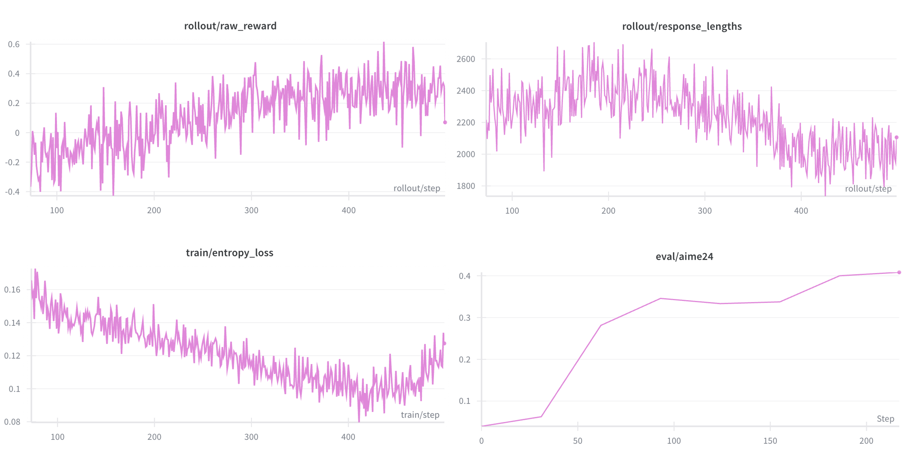
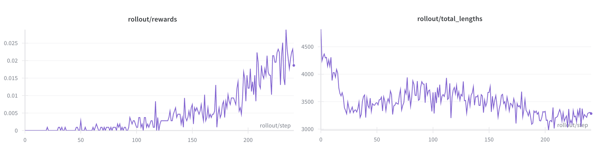

<h1 align="center">
  <br>
  Dual-Agent Training Framework for Long-Context Summarization
  <br>
</h1>

<p align="center">
  <a href="https://arxiv.org/abs/2508.05731"></a>
</p>

---

## 🌟 Overview

A fundamental challenge for tool-using language agents is handling **multi-step reasoning** over rich interaction histories, where the agent repeatedly calls tools and produces intermediate outputs before a final answer. Training such systems with **reinforcement learning (RL)** is difficult: trajectories are long, rewards are sparse and delayed, and full interaction histories can easily exceed the model’s context window, causing truncation, noisy credit assignment, and expensive evaluation of overlong outputs.

To address this problem, we propose **DualAgent**, a **dual-agent training framework** that separates *solving the task* from *summarizing the task so far*. An **Answering Agent** carries out multi-round reasoning and tool use, while a **Summarizing Agent** periodically compresses the ongoing interaction into a concise semantic summary once it becomes overlong. The Answering Agent then continues conditioned on this summary rather than the full history. For RL, we use only the final summary and its subsequent continuation as the conditioning context, yielding a **compact high-level representation** of long tool-use trajectories, alleviating context-length constraints, and **focusing the reward signal on semantically important decisions**.

<div align="center">
  
  <p><i>mainnn.</i></p>
</div>

---

## ⚙️ Setup

This section explains how to **prepare experiments, data and model** to start the code.

### 1. Model and Data Setup
- **Model**: font-info/qwen3-4b-sft-SGLang-RL, which is fine-tuned on Qwen3-4B-instruct-2507 in [slime/retool](https://github.com/THUDM/slime/tree/main/examples/retool)  
- **Datasets**: dapo-math-17k  
- **RL method**: GRPO  
- **Setup for summary agent**: separation of training and inference  

### 2. Environment Setup

- megatron  
- sglang   
- slime 

```bash
git clone https://github.com/Shakira12138/dual_agents_training.git
cd dual_agents_training
sbatch --nodes=2  --job-name=summary  submit_2nodes.sh slime-1106/examples/retool_summary/run_agent_summary_sbatch_router.sh
sbatch --nodes=2  --job-name=retool  submit_2nodes.sh slime-1106/examples/retool_summary/run_agent_retool_sbatch_router.sh
```

---
##  📊 Results

This section gives a brief, visual summary of DualAgent’s performance.  
All figures are stored in the `/pics` folder and can be replaced with your own plots.

### Overall Performance

We report the performance on math benchmarks AIME24, AIME25:

| iteration (models) | 0 (qwen3-4b-sft-SGLang-RL) | 159       | 259       | 309       | 329       | 399       | 419       | 459       |
|:------------------:|:--------------------------:|:---------:|:---------:|:---------:|:---------:|:---------:|:---------:|:---------:|
| AIME24             |            22.19           |39.11      |43.33      |           |42.08      |           |           |           |
| AIME25             |            18.30           |28.90      |30.94      |32.13      |30.57      |28.54      |30.37      |31.04      |

 
### Learning Curves

<div align="center">
  
  <p><i>Training curves for Agent A.</i></p>
</div>

<div align="center">
  
  <p><i>Training curves for Agent B.</i></p>
</div>

The evaluation of models and the wandb curves shows that the dual-agent system trains the dual agents successfully.


